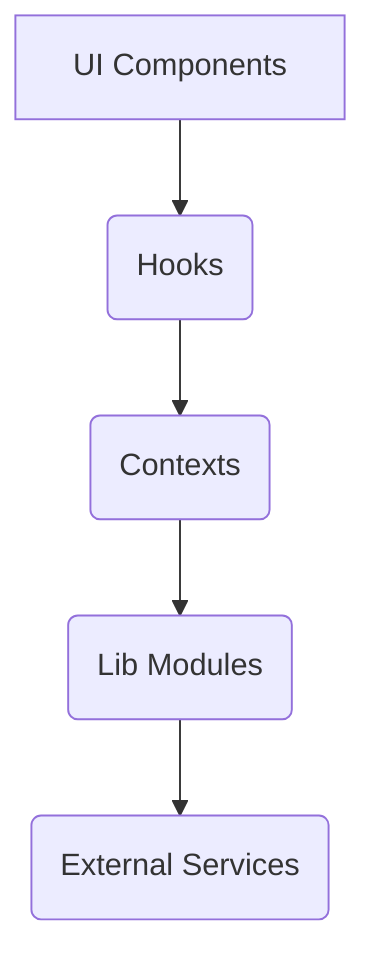

# アーキテクチャ設計書

## クリーンアーキテクチャ構成
```
src/
├── components/    # プレゼンテーション層（UIコンポーネント）
├── hooks/         # アプリケーション層（ビジネスロジック）
├── containers/      # アプリケーション層（状態管理）
├── lib/           # インフラ層（外部サービス連携）
└── store.ts       # データ層（永続化ストア）
```

## モジュール依存関係図


## 状態管理フロー
1. ユーザー操作 → UIコンポーネント
2. → カスタムフックで処理
3. → Contextで状態更新
4. → 永続化層（Firestore/AsyncStorage）
5. → ネイティブモジュール連携

