

2022/9/13 更新 

## EcorisMapとは？

EcorisMapは、スマホで位置情報を記録、確認できるアプリです。

主な特徴
- 位置情報を地図上に表示、記録できます。
- 地図タイル形式で公開されている任意の地図を読み込めます。
- GISで作成したGeoJSONやGPX形式のデータをインポートしラベルや色を設定できます。
- 記録したい項目を自分で設定でき、リストやチェックボックスなどのフォームも利用できます。
- 記録したデータは、CSV、GeoJSON、GPX形式でエクスポートできます。
- インターネット環境がない場所でもオフラインモードで使用できます。

ウェブサイト　https://ecoris-map.web.app

## クイックスタート
### 主要な画面

|ホーム|ポイント追加|地図選択|地図の設定|
|-|-|-|-|
|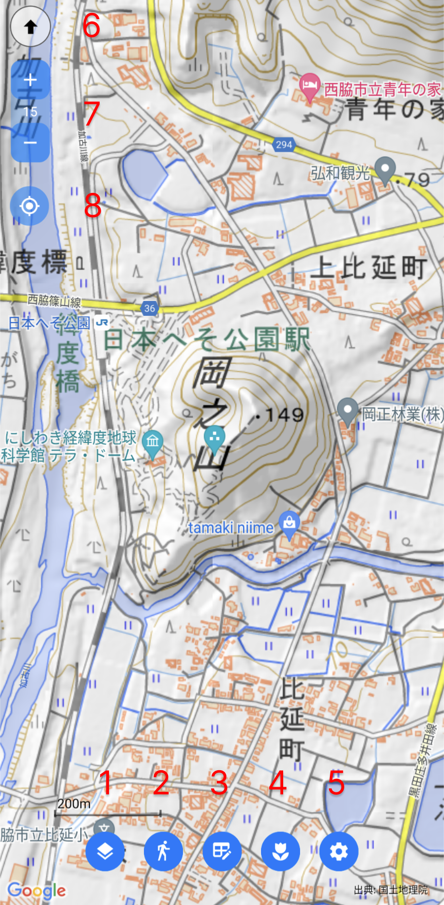|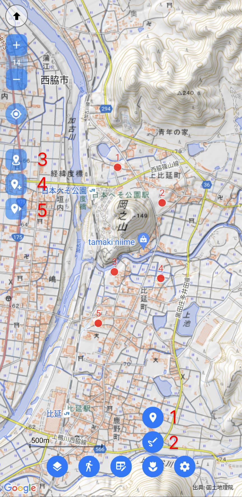|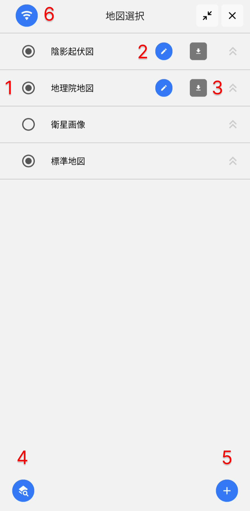|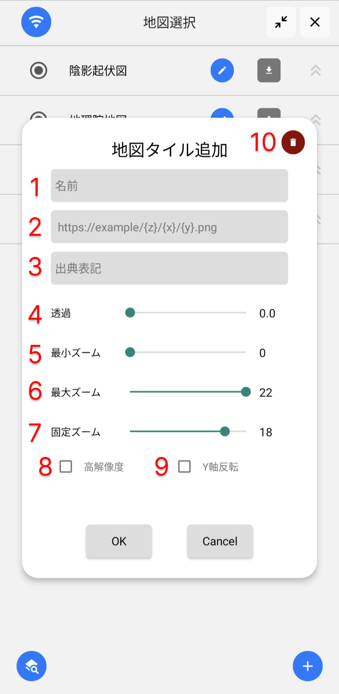|

|レイヤ一覧|レイヤ設定|データ|データ編集|
|-|-|-|-|
|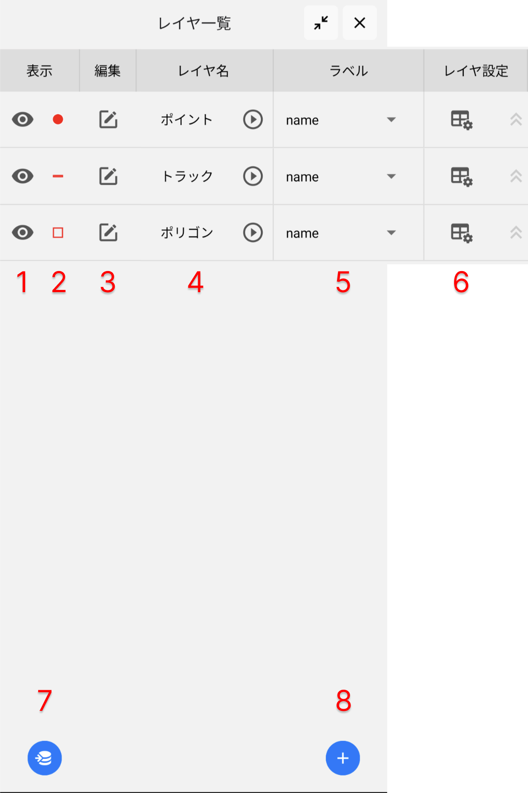|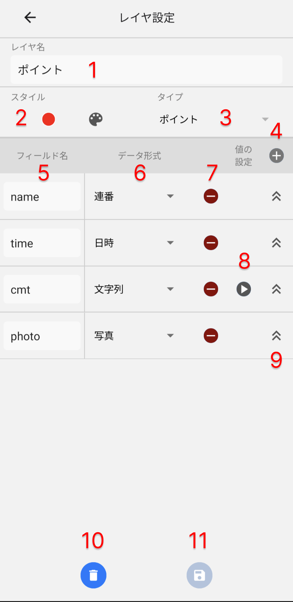|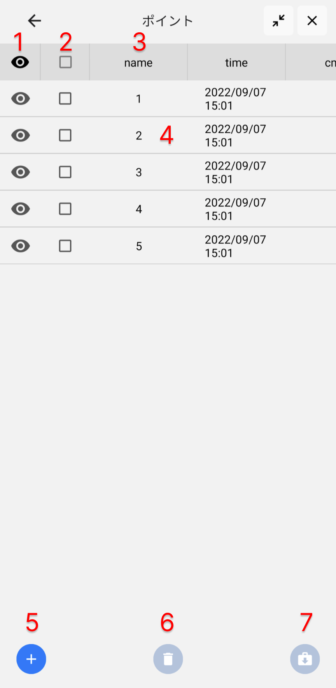|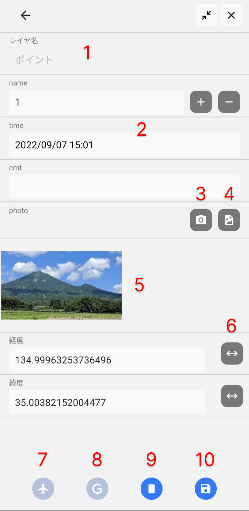|

### 手順
#### A. 地図の準備
  1. ホーム画面で地図選択ボタンを押します。
  2. 地図選択画面で表示したい地図を選択します。
  3. オフラインで使用する場合は、地図をダウンロードしておきます。
  4. 地図を追加したい場合は、地図の設定を新規で追加するか地図の設定リストから選択します。

#### B. 表示するデータの準備
  1. ホーム画面からレイヤ一覧ボタンを押します。
  1. インポートボタンを押して表示したいデータ（GeoJSONかGPX）をインポートします。
  2. データのスタイル（色）を変更します。
  3. ラベルを表示したい場合はラベルに使用するフィールド名を選択します。

#### C. 記録用レイヤの設定
  1. レイヤ一覧画面で、新規追加ボタンを押してデータの記録に使用するレイヤを作成します。
  2. レイヤ設定画面で、レイヤ名、スタイル、フィールドを追加して保存します。
  3. 既存のレイヤを編集する場合は、レイヤ設定ボタンを押して編集します。

#### D. 現地での使用
  1. GPSをオンにして現在地に移動します。
  2. オフラインで使用する場合は、地図選択画面でオフラインモードに切り替えます。
  3. トラックを記録する場合は、トラックボタンを押して記録を開始します。もう一度押すと記録を終了します。
  4. 位置情報を記録する場合は、レイヤ一覧画面で対象レイヤを編集モードに切り替えます。
  4. ホーム画面でポイントツールかラインツールを選択して、ポイントやラインを追加します。
  5. データ編集画面でフィールドの値を入力して保存します。

#### E. データのエクスポート
  1. レイヤ一覧画面からレイヤを選択してデータを表示します。
  2. データを選択してエクスポートボタンを押します。

## 基本操作

### ホーム
ホーム画面では、地図と各種機能のボタンを操作します。

**(1) 地図選択ボタン**
地図選択画面を開きます。

**(2) トラックを記録**
トラックボタンを押して記録を開始します。もう一度押すと記録を終了します。トラックは編集モードになっているラインタイプのレイヤに記録されます。cmtフィールドには、総距離が記録されます。（cmtフィールドがない場合は記録されません）

**(3) レイヤ一覧ボタン**
レイヤ一覧画面を開きます。

**(4) ポイント・ラインツールを選択**
ポイントツール、ラインツールを表示します。

**(5) 設定ボタン**
設定画面を開きます。

**(6) コンパス**
地図のノースアップ(北方向が上)とヘディングアップ(進行方向が上)を切り替えます。

**(7) ズーム**
地図の縮尺を変更します。画面をピンチイン、アウトしても変更できます。

**(8) GPS**
GPSを起動して現在地を表示します。起動時は現在地追従モードになっています。地図をドラッグすると追従モードが解除されるので、もう一度、GPSボタンを押すと追従モードになります。追従モードの時にGPSボタンを押すとOFFになります。
現在地を示すマーカーは、オレンジ色は精度?m以内、赤色は精度?m以内を表ます。

 

### 地図選択
地図選択画面では、表示する地図の選択と設定をします。

**(1)地図の選択**
表示する地図を選択します。透過設定のある地図は、下の地図と重ね合わせて表示できます。

**(2)地図設定ボタン**
地図の設定を開きます。

**(3)ダウンロードボタン**
地図のダウンロード画面を開きます。

**(4)地図の設定リストボタン**
事前に登録してある地図の設定リストを開きます。

**(5)地図設定追加ボタン**
地図設定の新規追加画面を開きます。

**(6)オフラインモードの切り替え**
オフラインモードとオンラインモードを切り替えます。オフラインモードは事前にダウンロードした地図をキャッシュから読み込んで表示します。インターネット環境がない場所で使用します。

 

### 地図のダウンロード
地図のダウンロード画面では、オフライン用に地図をダウンロードします。
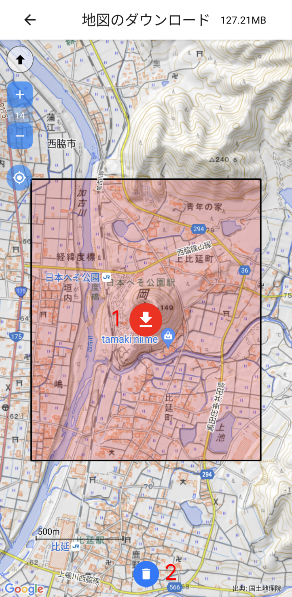

**(1)地図のダウンロード**
必要なエリアと範囲に移動してダウンロードボタンを押します。そのエリアをカバーするズームレベル0〜16の地図をダウンロードします。

**(2)地図の削除**
ダウンロード済みの地図を削除します。ダウンロード済みのエリアは、オレンジ色で表示されます。
 

### 地図の設定
地図の設定画面では、地図タイルの登録と表示設定をします。

**(1)地図の名前**

**(2)地図タイルのURL**
https://example/{z}/{x}/{y}.png のような形式で入力します。地図の利用規約を読んで使用可能か判断してください。

**(3)出典表記**
地図の利用規約に従って出典を表記してください。

**(4)透過設定 0(不透明)〜1(透明)**
透過設定のある地図は、下の地図と重ね合わせて表示できます。陰影起伏図を重ね合わせて表示したい場合などに使用します。

**(5)最小ズーム**
この値未満のズームレベルでは地図を表示しません。

**(6)最大ズーム**
この値より大きいズームレベルでは地図を表示しません。

**(7)固定ズーム**
この値より大きいズームレベルでは固定ズームレベルの地図を拡大して表示します。

**(8)高解像度**
一つあとのズームレベルの地図を表示します。地理院地図の標準地図で詳細な地図を広域に表示したい場合などに使用します。

**(9)Y軸反転**
TMSタイル（Y軸の原点は下）を読み込むときにチェックを入れます。デフォルトはXYZタイル（Y軸の原点は上）になっています。

**(10)設定を削除**
この地図設定を削除します。

 

### 地図の設定リスト
地図の設定リスト画面では、事前に登録した地図設定を表示します。
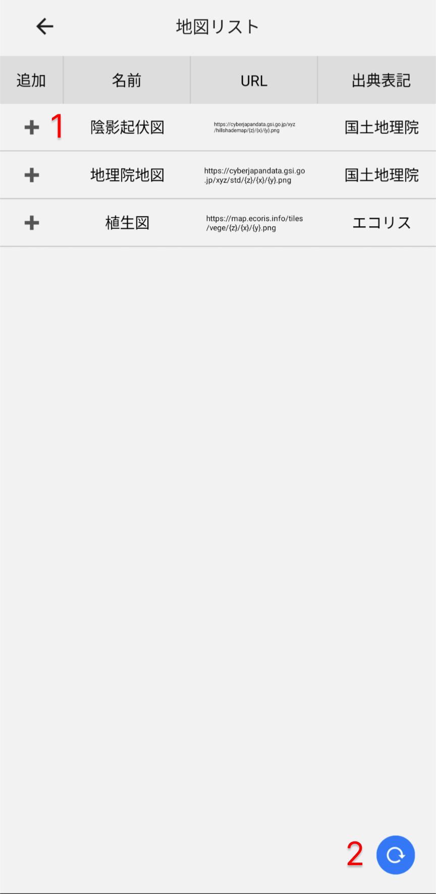

**(1)地図設定追加ボタン**
地図選択画面に地図の設定が追加されます。

**(2)リロードボタン**
事前に登録してある地図の設定リストを読み込みします。地図の設定リストのURLは、設定画面で指定します。

 

### レイヤ一覧
レイヤ一覧画面では、レイヤの一覧を表示し、そのデータやレイヤの設定にアクセスします。

**(1)表示切り替えボタン**
レイヤのデータを表示するか切り替えます。

**(2)スタイルボタン**
レイヤのスタイル設定画面を開きます。

**(3)編集チェックボックス**
編集モードにするレイヤを選択します。ポイントやラインを追加、編集するときは編集モードになっているレイヤが対象になります。同じタイプ(ポイントやライン)のレイヤは同時に編集モードにできません。

**(4)データ確認**
レイヤ名をタップするとそのレイヤのデータ画面を開きます。

**(5)ラベル設定**
ラベルとして表示するフィールド名を選択します。

**(6)レイヤ設定ボタン**
レイヤの設定画面を開きます。

**(7)データインポートボタン**
GeoJSONかGPXのデータをインポートします。GeoJSONは、緯度経度のポイント、ライン、ポリゴンのデータに対応しています。GPXはウェイポイント、トラックのデータに対応しています。ファイルをEcorisMapで直接開いてもインポートできます。

**(8)レイヤ設定追加ボタン**
レイヤ設定画面を開いてレイヤを新規追加します。

 

### レイヤ設定
レイヤ設定画面では、レイヤ名、タイプ、データのフィールドを設定します。

**(1)レイヤ名**
レイヤ名を入力します。

**(2)スタイル設定ボタン**
スタイル設定画面を開きます。

**(3)タイプ選択**
タイプを選択します。ポイント、ライン、ポリゴン、なし、に対応しています。ポリゴンは読み込み専用です。「なし」は位置情報のないデータの記録に使用します。

**(4)フィールド追加ボタン**
フィールドを追加します。

**(5)フィールド名**
フィールド名を入力します。

**(6)データ形式**
データ形式を選択します。文字列、連番、日時、日付、時間、時間範囲、整数、小数、数値範囲、リスト、ラジオボタン、チェックボタン、写真、テーブル、リストテーブルに対応しています。

**(7)フィールド削除ボタン**
フィールドを削除します。

**(8)デフォルト値、リスト項目を設定**
文字列、整数のフィールドのデフォルト値を設定します。リスト、ラジオボタン、チェックボタン、テーブル、リストテーブルの候補値を設定します。

**(9)表示順変更ボタン**
フィールドの表示順を変更します。

**(10)レイヤ削除ボタン**
レイヤとそのデータを削除します。

**(11)設定を保存**
レイヤ設定の変更を保存します。

 

### スタイル設定
スタイル設定画面では、レイヤのスタイル(色)を設定します。
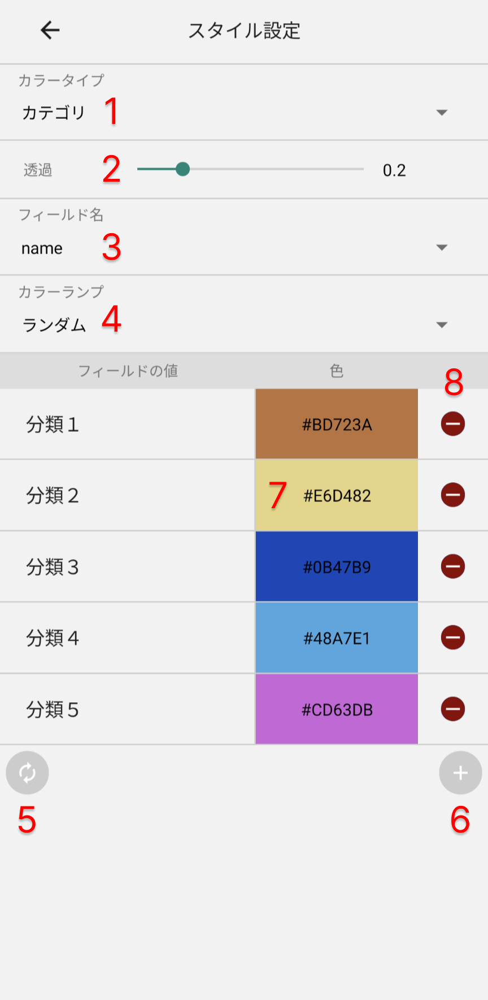

**(1)カラータイプ**
色の塗り方を選択します。単色、カテゴリに対応しています。カテゴリはフィールドの値ごとに色を塗り分けます。

**(2)透過**
ポリゴンのときに塗りの透過設定をします。0(不透明)〜1(透明)。透過設定を1にするとポリゴンの枠を表示します。

**(3)フィールド名**
カラータイプがカテゴリのときにフィールド名を選択します。

**(4)カラーランプ**
カラータイプがカテゴリのときに自動で取得する色の塗り方を選択します。現時点ではランダムのみ対応しています。

**(5)自動取得ボタン**
カラータイプがカテゴリのときにフィールドの値を自動で取得し、その色をカラーランプに従い設定します。

**(6)色追加ボタン**
カラータイプがカテゴリのときにフィールド値の色を手動で追加します。

**(7)色設定**
色をカラーピッカーで選択します。

**(8)色設定削除ボタン**
フィールドの色設定を削除します。

 

### フィールド値の設定
フィールド値の設定画面では、フィールドのデフォルト値やリストやチェックボックスの候補値を設定します。
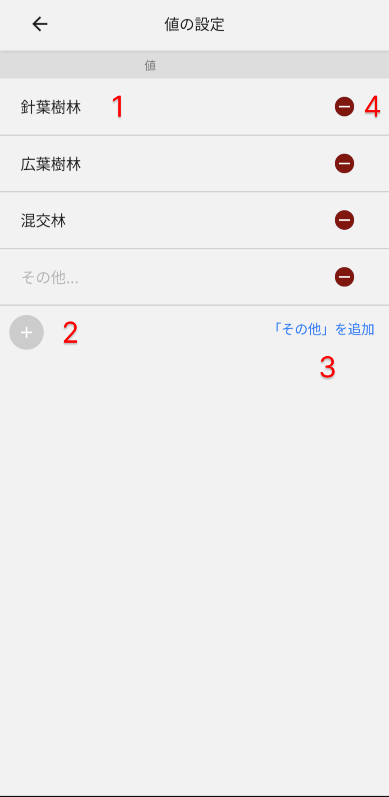

**(1)値**
デフォルト値もしくはリスト、チェックボックスの値を入力します。

**(2)値の追加ボタン**
値を追加します。

**(3)「その他」の値追加**
「その他」の値を追加します。

**(4)値削除ボタン**
値を削除します。

 

### データ
データ画面では、データの一覧を表示し、各データのアクセスと操作をします。

**(1)表示切り替えボタン**
データの表示を切り替えます。ヘッダーのボタンは全データを切り替えます。

**(2)データ選択チェックボックス**
削除もしくはエクスポートするデータを選択します。ヘッダーのチェックボックスで全データを選択します。

**(3)昇順、降順を変更**
フィールド名をタップするとデータ表示の昇順、降順を変更します。

**(4)データの入力、編集**
データをタップするとそのデータの編集画面を開きます。

**(5)データ追加ボタン**
新規のデータを追加します。座標のデフォルト値は0,0になっています。

**(6)削除ボタン**
選択されたデータを削除します。

**(7)エクスポートボタン**
選択されたデータをエクスポートします。

 

### データ編集
データ編集画面では、データの入力と編集をします。

**(1)レイヤ名**
データのレイヤ名が表示されます。

**(2)フィールド**
フィールドのタイプに応じて値を入力、選択します。

**(3)写真撮影ボタン**
写真を撮影します。

**(4)写真選択ボタン**
写真を選択します。

**(5)写真の表示、削除**
写真をタップすると写真を大きく表示します。削除もできます。

**(6)座標表示切り替えボタン**
座標の表示を10進と60進で切り替えます。

**(7)データに移動ボタン**
データの場所に地図を移動します。

**(8)GoogleMapボタン**
データの場所をGoogleMapで表示します。経路情報などを利用する際に便利です。

**(9)削除ボタン**
データを削除します。

**(10)保存ボタン**
データの変更を保存します。

 

### ポイント追加
ポイントツールでポイントの位置情報を追加します。

**(1)ポイントツール表示ボタン**
ポイントツールを表示します。

**(2)ラインツール表示ボタン**
ラインツールを表示します。

**(3)現在地に追加ボタン**
現在地にポイントを追加します。ボタンを選択した状態(赤)で、ボタンを長押しします。GPSをオンにしておく必要があります。

**(4)任意の場所に追加ボタン**
地図上のタップした場所にポイントを追加します。

**(5)ポイントの移動ボタン**
ボタンを選択した状態で、ポイントを長押した後ドラッグして移動させます。

 

### ライン追加
ラインツールでラインの位置情報を追加します。
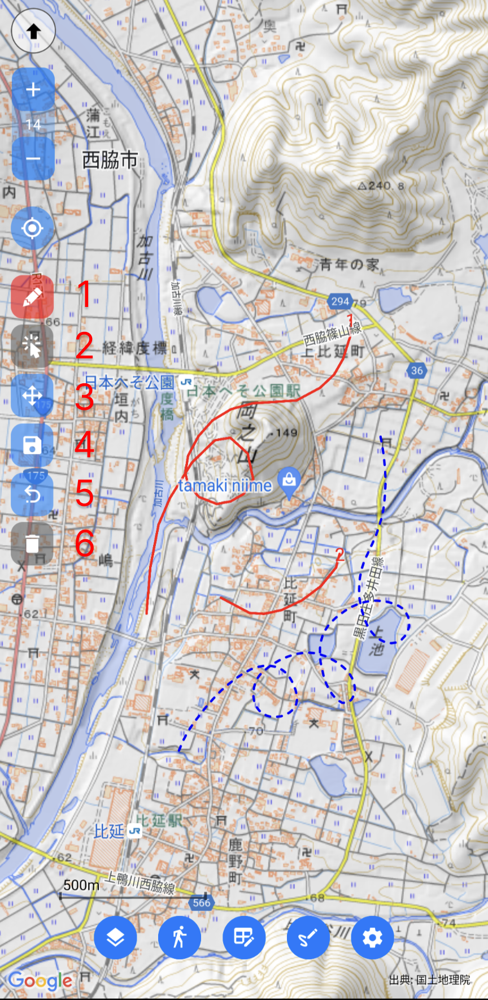

**(1)ライン追加ボタン**
地図上をなぞってラインを追加します。選択状態(青の破線)でラインをなぞるとラインを修正できます。

**(2)ライン選択ボタン**
修正したいラインを選択します。ボタンを選択して修正したいラインをタップします。選択するとラインが青の破線になります。

**(3)画面移動ボタン**
ラインの選択状態のまま画面を移動する時に使用します。ボタンを選択して地図をドラッグします。

**(4)保存ボタン**
ラインの編集を保存します。

**(5)やり直しボタン**
ラインの編集を一回やり直します。二回押すとそれまでの編集を破棄します。

**(6)削除ボタン**
選択しているラインを削除します。

 

### 画面分割
ホーム画面を分割して表示できます。
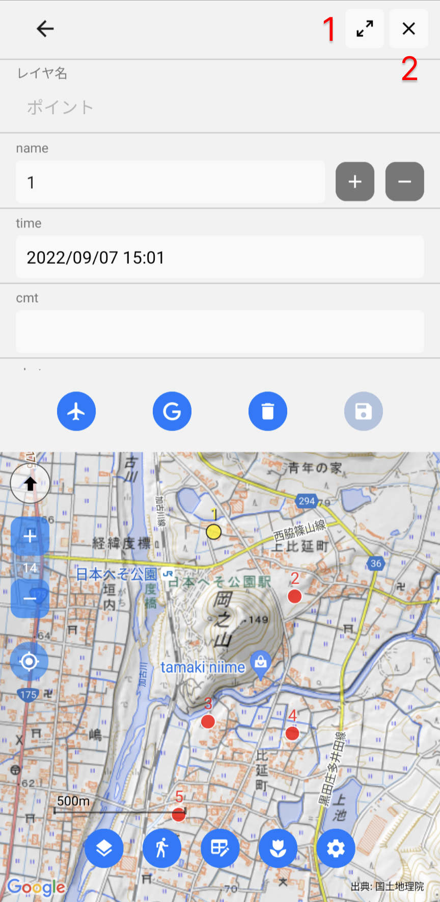

**(1)画面分割ボタン**
表示画面の分割と全画面表示を切り替えます。データと地図を同時に見たいときに使用します。

**(2)閉じるボタン**
表示画面を閉じてホーム画面を表示します。

 

### 設定
設定画面では、各種設定とマニュアル等を参照できます。
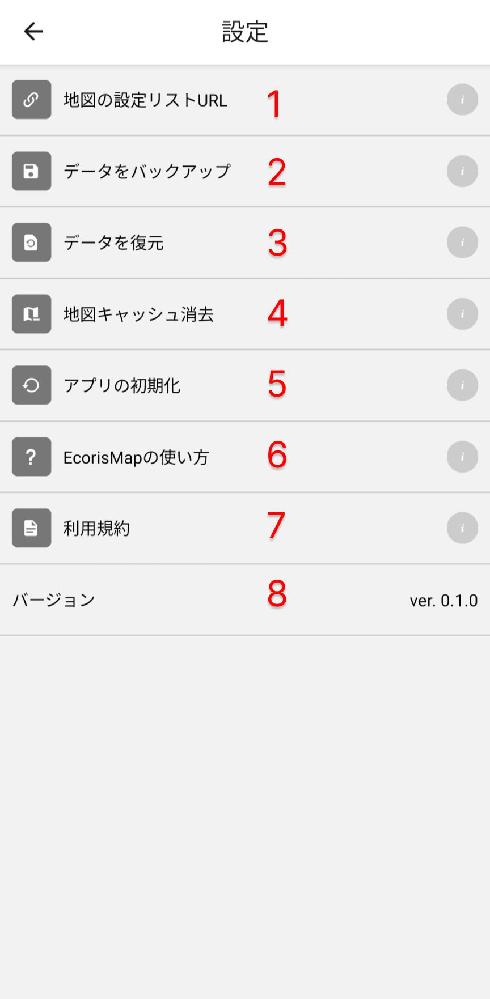

**(1)地図の設定リストURL**
地図の設定リストのURLを指定します。地図の設定リスト画面では、ここで指定したURLのデータを読み込みます。

**(2)データをバックアップ**
現在のデータや設定を保存します。以前のバックアップデータは上書きされます。

**(3)データを復元**
保存されているデータと設定を復元します。

**(4)地図キャッシュ消去**
ダウンロードした地図のキャッシュを全て消去します。

**(5)アプリの初期化**
アプリを初期状態に戻します。デバイス内のEcorisMapのデータと設定が全てリセットされます。

**(6)EcorisMapの使い方**
使い方(このサイト)を表示します。

**(7)利用規約**
利用規約を表示します。

**(8)バージョン**
バージョンを表示します。

 

## 応用編

### 地図の設定リストを作成
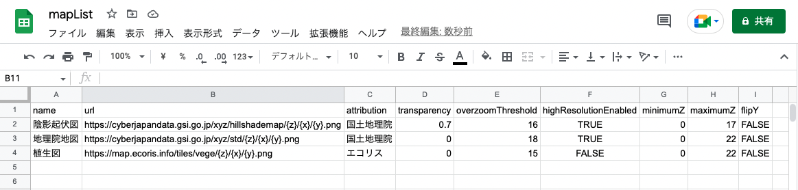

地図の設定リストをGoogleスプレッドシートで作成しておくと、それをEcorisMapで読み込むことができます。

1. Googleスプレッドシートの1行目に以下の設定項目名を正しく入力します。
  - name
  - url
  - attribution
  - transparency
  - overzoomThreshold
  - highResolutionEnabled
  - minimumZ
  - maximumZ
  - flipY
2. 2行目に設定値を入力します。
3. メニューからファイル --> ウェブに公開 --> シートを選択 --> カンマ区切り形式(.csv)を選択 
   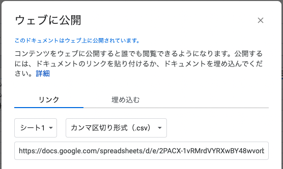
4. リンクをコピーして、EcorisMapの設定 --> 地図の設定リストURL　に貼り付けます。
5. 地図の設定リスト画面でリロードボタンを押すと読み込むことができます。